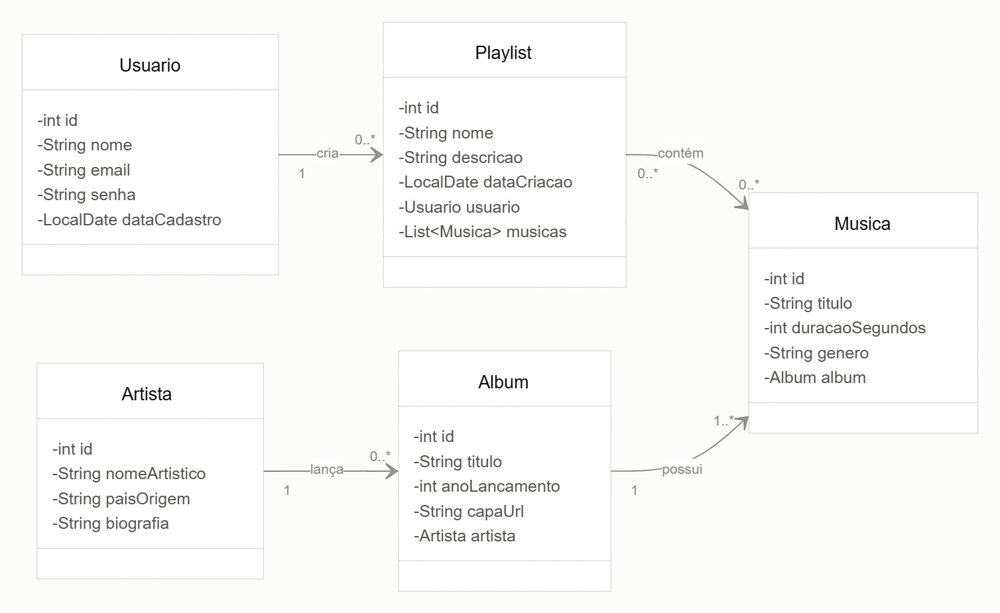
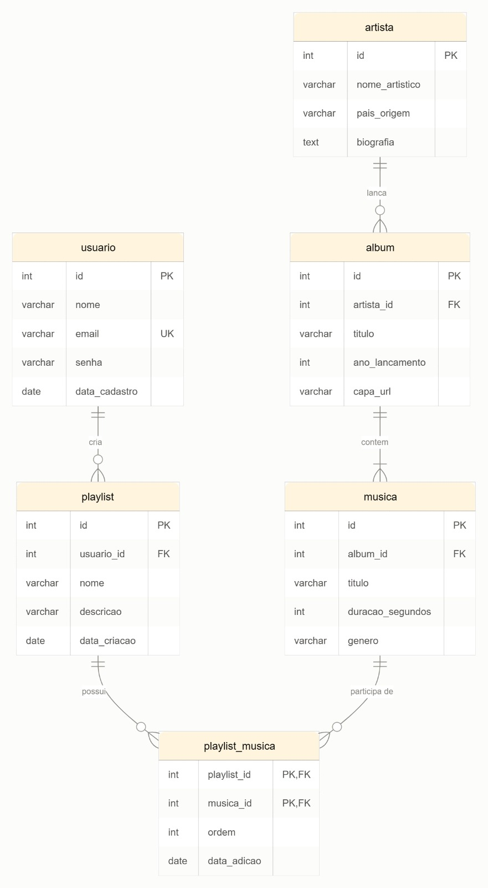
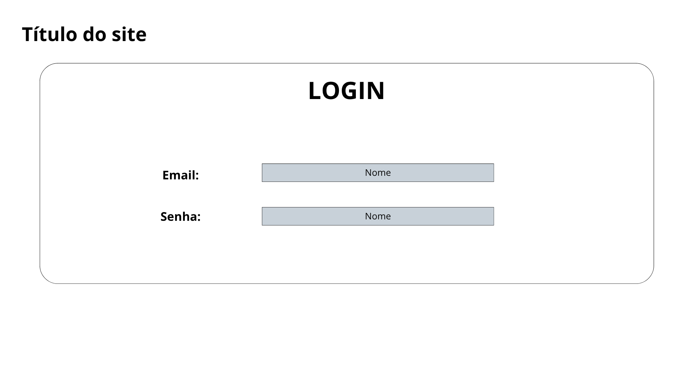
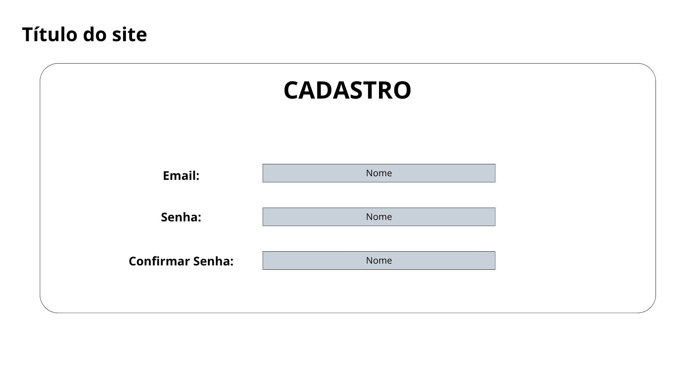
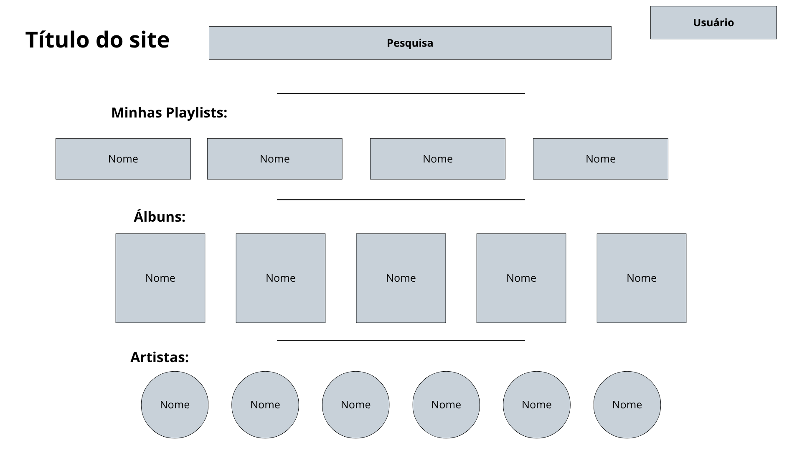
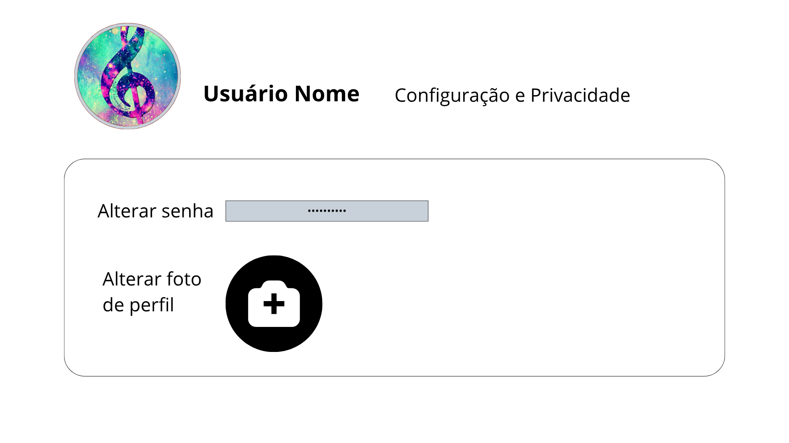
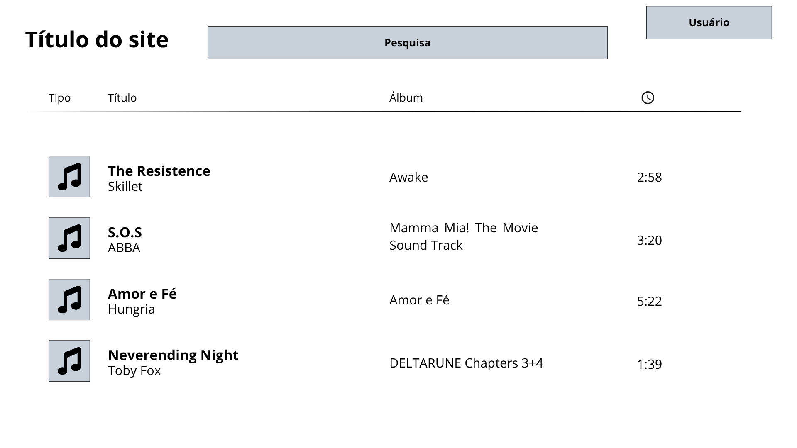

# Emipy3

Sistema desktop de cadastro e pesquisa de músicas, álbuns e artistas, desenvolvido em **Java** com interface **Java Swing**, banco de dados relacional e padrão **MVC**.

> **Disciplina:** Programação Orientada a Objetos II

> **Professor(a):** Leanderson

> **Turma:** 144-4CN | **Semestre:** 4º Semestre

> **Integrantes:** Arthur de Lima Barbosa, Bernardo Henrique Budal, Igor Otávio Duarte, Julia Paz de Lima Santos e Yasmin Gabrielli Venturi

---

## Sobre o projeto

O Emipy3 é um catálogo musical. Nele é possível cadastrar artistas (solo ou banda), músicas e álbuns, mantendo a relação entre eles, e depois pesquisar tudo de forma simples e rápida.

A ideia é centralizar em um único banco as informações de quais músicas pertencem a cada álbum e quais álbuns e faixas cada artista possui.

## Objetivo

Desenvolver um sistema em Java que permita cadastrar e pesquisar músicas, álbuns e artistas, usando banco de dados e o padrão MVC.

## Funcionalidades

**Administrador**
- Cadastrar, consultar, alterar e excluir artistas, álbuns, músicas e usuários
- Vincular músicas aos álbuns e artistas

**Usuário comum**
- Pesquisar músicas por nome, artista ou álbum
- Pesquisar álbuns e artistas
- Criar e gerenciar playlists

## Requisitos do trabalho

- Integração com banco de dados
- 4 ou mais tabelas (o projeto usa 6: `artista`, `album`, `musica`, `usuario`, `playlist` e `playlist_musica`)
- Várias telas (login, menu, pesquisa, cadastros e playlists)
- Padrão de projeto MVC

## Tecnologias

- Java
- Java Swing
- MySQL (via JDBC)
- Padrão MVC com camada DAO

## Estrutura planejada

```
src/
├── model/        # entidades
├── dao/          # acesso ao banco de dados
├── view/         # telas Swing
└── controller/   # ligação entre telas e dados
```

## Etapas

- [x] Definição do tema
- [x] Diagrama de Classes
- [x] Diagrama MER
- [x] Protótipos de Telas
- [ ] Criação do banco de dados
- [ ] Implementação (model, dao, view e controller)
- [ ] Testes e entrega final

## Diagramas

**Diagrama de Classes**




**Diagrama MER**



## Protótipos

**Tela de Login**



**Tela de Cadastro**



**Tela Inicial**



**Tela de Editar Perfil**



**Tela de Pesquisa**



